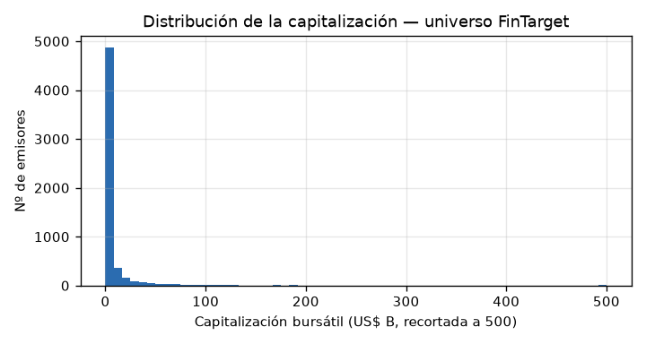
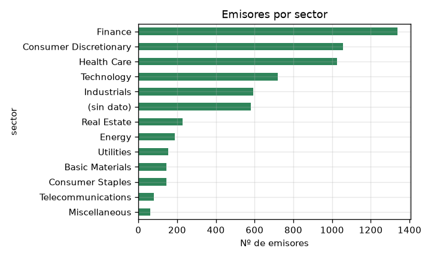
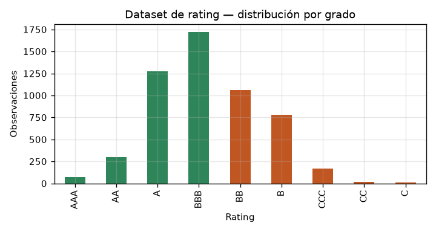

## Datos y descarga

[← Volver al inicio](index.md) · [Arquitectura](arquitectura.md) · [Roadmap](roadmap.md)

Todo el universo y las etiquetas provienen de fuentes públicas. Los enlaces de abajo son
**directos y reproducibles**: descargan el archivo sin credenciales (salvo donde se indica).
Las peticiones a la SEC requieren una cabecera `User-Agent` con un contacto (política del
regulador). Los ficheros ya descargados están en
[`data/`](https://github.com/Hyper-Target/FinTarget/tree/main/data) del repositorio.

---

## 1 · Universo de empresas

| Fuente | Contenido | Enlace directo |
|---|---|---|
| S&P 500 (mantenido) | 500 constituyentes con **CIK**, sector y sub-industria GICS | `https://raw.githubusercontent.com/datasets/s-and-p-500-companies/main/data/constituents.csv` |
| SEC — ticker → CIK | Mapa de todos los emisores que reportan a la SEC | `https://www.sec.gov/files/company_tickers.json` |
| SEC — ticker → CIK + bolsa | Igual, con la bolsa (NYSE / Nasdaq / …) | `https://www.sec.gov/files/company_tickers_exchange.json` |
| Nasdaq *stock screener* | ~7.100 acciones de EE. UU. con **capitalización bursátil**, sector, industria y año de salida a bolsa | `https://api.nasdaq.com/api/screener/stocks?tableonly=true&limit=10000&download=true` — requiere `User-Agent` de navegador |
| Russell 2000 (oficial) | Tenencias del ETF **IWM** de iShares | Página del ETF → *"Download holdings"*; iShares exige aceptar un descargo, por eso no hay enlace directo estable |
| FTSE Russell — reconstitución | Fechas y listas oficiales de los índices Russell 1000 / 2000 / 3000 (anual, junio) | `https://www.lseg.com/en/ftse-russell/index-reconstitution` |

**Nota sobre el Russell 2000.** Como la descarga oficial exige aceptar un descargo, el proyecto
reconstruye una **aproximación pública** con
[`fintarget/ingest/build_universe.py`](https://github.com/Hyper-Target/FinTarget/blob/main/fintarget/ingest/build_universe.py):
ordena el universo por capitalización y define los tramos `r1000` (las ~1.000 mayores, *large/mid
cap*), `r2000` (las ~2.000 siguientes, *small cap* — el uso que nos interesa: **empresas
pequeñas, que son la mayoría de las que llegan a una junta**) y `micro` (el resto).

---

## 2 · Fundamentales (estados financieros)

| Fuente | Contenido | Enlace directo |
|---|---|---|
| SEC EDGAR — *companyfacts* (por empresa) | Todos los hechos financieros en XBRL, serie histórica completa | `https://data.sec.gov/api/xbrl/companyfacts/CIK##########.json` (CIK a 10 dígitos con ceros) |
| SEC EDGAR — *companyconcept* | Una sola métrica (p. ej. `Revenues`) por empresa, todos los períodos | `https://data.sec.gov/api/xbrl/companyconcept/CIK##########/us-gaap/Revenues.json` |
| SEC EDGAR — *companyfacts* masivo | Todas las empresas en un `.zip` (~18 GB descomprimido) | `https://www.sec.gov/Archives/edgar/daily-index/xbrl/companyfacts.zip` |
| SEC — *Financial Statement Data Sets* | Estados financieros normalizados, un `.zip` por trimestre desde 2009 | `https://www.sec.gov/dera/data/financial-statement-data-sets` |
| SEC — *submissions* masivo | Historial de *filings* de cada emisor | `https://www.sec.gov/Archives/edgar/daily-index/bulkdata/submissions.zip` |

---

## 3 · Narrativa (para el NLP Model)

| Fuente | Contenido | Enlace directo |
|---|---|---|
| **EDGAR-CORPUS** (HuggingFace) | ~220.000 10-K parseados por ítem (1A, 7, …), 1993–2020. **No *gated***. | `https://huggingface.co/datasets/eloukas/edgar-corpus` — `load_dataset("eloukas/edgar-corpus", "full")` |
| EDGAR — búsqueda de texto completo | API de *full-text search* sobre todos los *filings* | `https://efts.sec.gov/LATEST/search-index?q=%22...%22&forms=10-K` |
| EDGAR — índice de *filings* por empresa | Lista de 10-K de un CIK, para el *parser* propio 2021–2025 | `https://www.sec.gov/cgi-bin/browse-edgar?action=getcompany&CIK=##########&type=10-K` |

---

## 4 · Etiquetas (variable objetivo y validación externa)

| Fuente | Contenido | Enlace directo |
|---|---|---|
| **Rating crediticio con ratios** (con CIK) | 5.403 empresa-año, 678 emisores, 2010–2016; 16 ratios, **CIK y SIC**, 22 escalones + binaria grado de inversión / *high yield* | `https://raw.githubusercontent.com/Mengmeara/CCRD-Dataset/main/CCRDataset/raw/ccrd_financial_raw.csv` |
| *Corporate Credit Rating* (Agewerc) | 2.029 empresa-año, 2014–2016, 25 ratios, 10 clases; sin CIK — para robustez | `https://raw.githubusercontent.com/Agewerc/ML-Finance/master/data/corporate_rating.csv` |
| *US Company Bankruptcy Prediction* (Kaggle, CC0) | ~78.000 empresa-año, 1999–2018, 18 variables tipo Altman | `kaggle datasets download -d utkarshx27/american-companies-bankruptcy-prediction-dataset` (requiere token de Kaggle) |

Licencia de origen del dataset principal de rating: **CC BY 4.0**.

---

## 5 · Mercado e índices (betas, retornos, tasas)

| Fuente | Contenido | Acceso |
|---|---|---|
| Yahoo Finance (`yfinance`) | Precios de acciones e índices: `^GSPC` (S&P 500), `^RUT` (Russell 2000), `IWM` | `pip install yfinance` — `yf.download("^RUT", start="2009-01-01")` |
| Damodaran (NYU) | Betas desapalancadas por industria, *ERP*, prima de riesgo país | `https://pages.stern.nyu.edu/~adamodar/New_Home_Page/data.html` |
| FRED (Reserva Federal de St. Louis) | Tasa libre de riesgo (UST), *spreads* de crédito, macro | `https://fred.stlouisfed.org/` — API con clave gratuita |

---

## Primer EDA del universo

Generado por
[`notebooks/00_eda.py`](https://github.com/Hyper-Target/FinTarget/blob/main/notebooks/00_eda.py)
a partir de las fuentes 1 y 4.

- Universo cotizado de EE. UU.: **6.314** emisores; **93 %** mapeables a SEC EDGAR / XBRL / 10-K.
- En el S&P 500: **494**. Tramos: *large/mid* (r1000) **1.000** · *small* (r2000) **2.000** · micro **876**.
- Del dataset de rating, **553 de 686** emisores (81 %) siguen cotizando y están en el universo
  actual → hay continuidad para validar el modelo con datos recientes.

El detalle en tablas está en
[`reports/eda/universo_resumen.md`](https://github.com/Hyper-Target/FinTarget/blob/main/reports/eda/universo_resumen.md).
